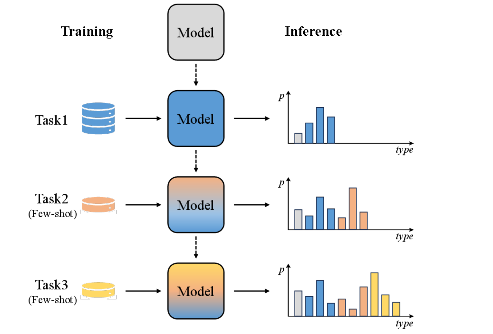

<h1 align="center">Prompt Tuning for Few-Shot Continual Learning Named Entity Recognition</h1>

  
  
  

# fewshotCLNER

> 📖 This repository contains the source code for our 2025 paper on **Prompt Tuning for Few-Shot Continual Learning Named Entity Recognition**. The project integrates **prompt-based fine-tuning** and **knowledge distillation** to address the challenges of continual NER under few-shot settings.

  
  <em>Figure 1: An illustration of the FS-CLNER task.</em>

🚧 **<mark>This project is still under active development</mark>**

